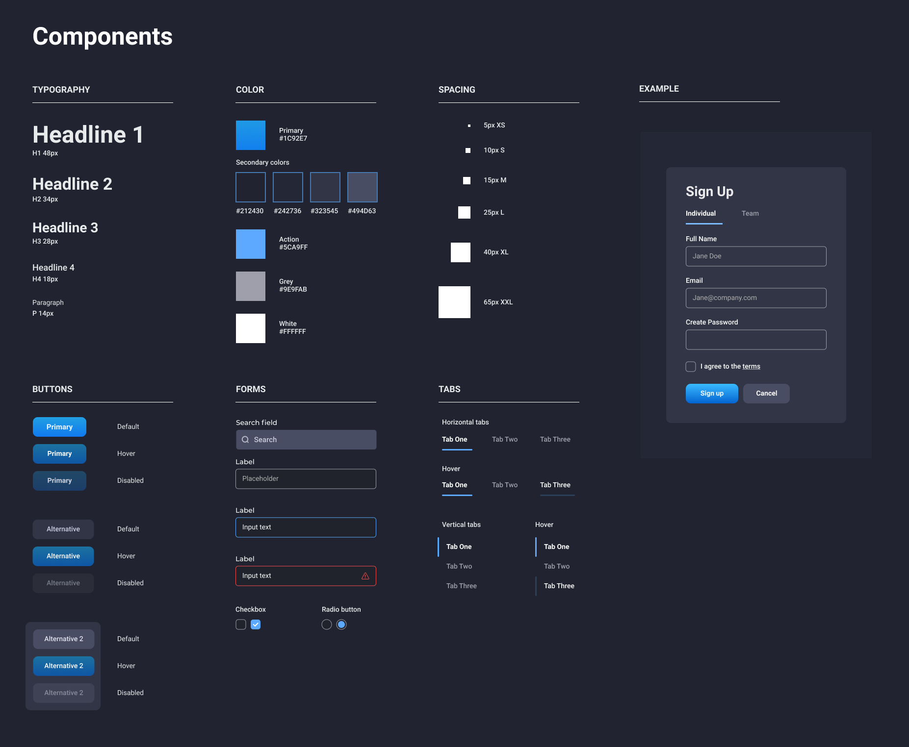
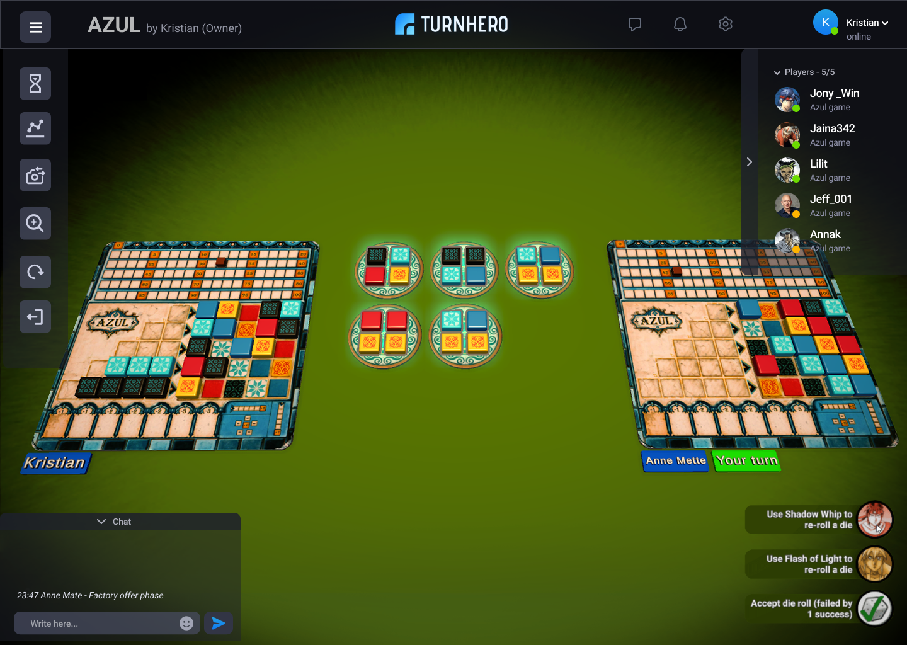

# UX design templates
The following templates and screens will be used as guidelines for updating the TurnHero UI.

## General design system

## Game overview

## Game information

## In-game menus (DRAFT)

---
# In-game menu

## All menus open

## All menus closed

## Optional menu and button locations
The idea there is that we can support left/right handed differences, especially for the thumb/action buttons.

## Radial menu
Using a radial menu instead of buttons in the bottom of the screen.

## Settings menu
